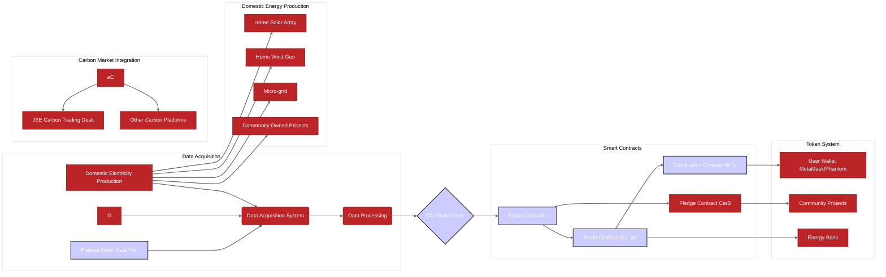

# WHITE PAPER

## PLEDGE-BASED COMMUNITY ENERGY MODEL WITH BLOCKCHAIN, CARBON CREDITS &  NET-METERING

## Version 1.0 "work in progress"

## Project Outline

For some months now we have been congregating around a draft constitution and business plan, informed by our working analysis of South Africa's energy crisis.

South Africa’s energy policy is stated in a variety of documents including the National Development Plan and the Electricity Regulation Act 2006. In addition there are proposed amendments (now adopted) contained in the Electricity Regulation Amendment Bill currently tabled before Parliament. Our province the Western Cape and our metro, the City of Cape Town, also have their own respective bylaws and regulations.

Under the current system the National Energy Regulator of South Africa (NERSA), regulates the market and sets tariffs. The outcome is that, both the wheeling of electricity supply and resulting tariff structure is rather limited, with consequences which equate to lack of availability of energy.

There are moves afoot under the current amendment bill, to divide Eskom into generation and distribution entities, with IPPs already an important part of the energy mix, and thus opening up the grid to competition within a hybrid model, this entails a major shift in public policy as it effects energy consumers.

In addition the metro has been experimenting with a system in which some corporates with large renewable energy installations are allowed to wheel energy to third parties. Details of the resulting billing systems are still opaque.

The current feed-in tariff approved by NERSA stands at 78.98c/kWh. The city's incentive (on top of the tariff) amounts to an additional 25c/kWh (103.98c/kWh). This however needs to be seen within the context of the domestic retail price 350.80 c/kWh (block 1 under 600kWh) & 426.56 c/kWh (block 2 over 600kWh)) which exceeds that of Eskom.  Prosumers with grid-tied feed-in metres are constrained insomuch as this quotient may be offset by the modest feed-in tariff, while ordinary consumers cannot.

Under the current system, which is organised much like a pyramid scheme, with the City setting the tariffs which occur in excess of the regulator guidance, and controlling all billing, there is essentially only one downstream market, with a single supplier and retail outlet for energy. Several pre-paid companies and prepaid metre token resellers do exist in a food chain where additional fees are incurred for use of payment and bankking gateways, but on the whole, there is a near total absence of market forces. IPPs for example cannot wheel energy directly to household consumers, though large corporates appear to be engaging in business-to-business transactions. The partial deregulation is thus a top-down approach, with the intention to extend the government and metro monopolies indefinitely.

## Collective & Shared Housing Schemes

Another dimension to the problem is the lack of policy with regard to collective schemes, shared housing projects and rental accommodation.  A renter with a prepaid metre may indirectly benefit from energy fed into the system by a ‘prosumer’ but is excluded from the feed-in tariff opportunity. This situation represents a restriction on market participation, and the market itself, represents a walled garden.

City Policy as it stands, assumes a one-to-one relationship where every home has a prepaid metre and every producer-consumer of domestic energy i.e. *prosumer*, similarly provisioned and rewarded accordingly. There are no options with regard to sharing infrastructure amongst *prosumers*, and no means by which a *prosumer* may wheel energy to and from his or her neighbour who lacks the ability to produce. Likewise, no options exist to lower barriers to entry, for collective schemes by way of a shared grid-tied feed-in metre.

## A Blockchain approach to a solution

Our proposed system initially involved an abstraction of the tariff structure as it stood. This meant that nothing further would be required from the City other than an endorsement of our plan, and we would thus take the feed-in tariff as our baseline, a known quantity.

As our system developed we realised that we could bypass the feed-in tariff, making it unnecessary to concern ourselves with the City. Our system primarly focuses on creating an 'Oracle of Data' based upon varifiable domestic production of watts.

In order to correct these deficiencies in public policy we initially aimed to create a pool into which ‘*prosumers*’ already servicing the City could pledge a proportion up to 100% of their output in the form of the feed-in-tariff rebate. But since this would mean those who are not able to feed-into-the-grid were left out, our latest iteration of our proposal relies soley upon **verified production of electricity eligible for carbon credits**.

We will keep our initial ideas active inside our white paper, in order to note them for future discussion, but for now, our aim is to simplify not complicate our utility.

> In summary our collective scheme **books one unit for every unit added to the common pool**  not just the City grid. 

We need to note here a pledge model is considered allowing actual energy to be pledged to our scheme, and in return an audit of one offset reward for every offset gained, and treated accordingly, but we will leave this thread for later.

This fundamental token, whether pledged or not, for the purposes of this white paper is measured in a proposed MuizenJoules/MegaJoules “mJ” token and constitutes our tokenised unit in issue, which is alble to accrue a carbon credit in the form of "aC" and which may further be pledged via a "Pay-it-Forward" scheme in the form of a third unit known as CarB.

### Tokenisation: Smart Contract, Pay-it-Forward, Energy Credits

Advances in Blockchain Technology make it possible to issue smart contracts. "Smart contract platforms” are thus **“decentralized systems that enable self-executing contracts on a blockchain,"**

Several blockchain technology platforms are currently used for executing smart contracts. According to George Lawton, they're usually characterized as level 1 (L1) or level 2 (L2) platforms.

L1 platforms are blockchains where smart contracts are executed directly on the main core platform. Prominent examples are Ethereum, Solana, Cardano and BNB Smart Chain.

L2 platforms execute the smart contracts on a parallel space so they can run more efficiently and quickly, then roll up changes to the core platform. Examples of L2 platforms include Ethereum ZK-Rollups, Ethereum Optimistic Rollups and Polygon. Many of the newer offerings support both L1 and L2 capabilities.

At this stage, our project would require a thorough cost-benefit evaluation of these platforms in order to arrive at the most cost-effective solution.  As detailed in the project README, Polygon is proposed since its gas fees are a lot lower than Ethereum.

#### The mJ Smart Contract

There are a number of variables and conditions that may exist in the form of a smart contract as proposed in mJ.  This smart contract, along with others detailed in [docs/README.md](docs/README.md), forms the core of our system.

1.  One mJ unit in its most basic form is minted for every one watt of variable domestic production of electricity. This is the current preferred method.

2. A pledge contract may also be generated within the mJ ecosystem, in which a Pledgor agrees to Pay-Energy-Forward to the Pledgee and likewise, may wish to reserve or store energy for the future. The mJ pledge contract exists until it is burnt via an act of distribution according to the underlying variable or condition.

3.  An idea: a person without energy, retrieves a pledgement from the common pool, but cannot withdraw all the energy at face value, because it has a conditional ratio: 60% awarded to needy users divided by the pool of actual users, or 40% awarded to *prosumers* divided by the pool of *prosumers*, who include the entire pool of *prosumers* including the originator. This exercise is currently not implemented but we leave this mental experiment here for future consideration.

4.  The pledge token is not fully burnt until all the conditions are fulfilled, thus it exists on the underlying chain as a smart contract entry until the max condition in , 60% needy and 40% prosumers, all utilise the token.the use caseL

5.  Another idea: A pledgor uses the mJ as a simple reserve of energy. The smart contract indicates that only he or she can redeem the token. It exists within the system, drawing nominal interest in the form of the secondary token proposed below.

### Carbon Register on the Blockchain

In its most basic form, mJ is traded for aC via the carbon trading desk API on various exchanges.

An incentive on top of the City incentive to produce further input to the grid and/or domestic surplus by adding initial pledged mJ, is found by creating an (immediate) reward to our members for their participation in the form of a secondary register of carbon credits. We are still investigating exact implementation.

Any resulting income stream may benefit the *prosumer* directly by either rewarding each holder of mJ with an additional token aC which together with mJ will represent a third entity ‘cArb’. mJ is thus redeemable for fiat and/or energy, allowing this unit to feed back into the system in the form of tokenised aC+ credits and the simple mJ, and distributed according to the variable conditions outlined in the previous smart contract section above.

## There is a big caveat at the face.

Rolling our own carbon credit system, in which the collective scheme registers the production of renewable energy on the system to generate aC+ credits to apply it to the global carbon credits regime can only exist if when the mJ is minted a corresponding carbon credit is not also added to the City coffers via a similar scheme.

Our pledge system would thus require an enforceable, contractual restraint issued against the City in favour of the collective scheme, and thus restraining the city booking credits in this way without our consent under common law. In any event, such a carbon trading scheme at City level does not appear to exist, yet.

Once a credit is booked on the system, in the form of mJ exchanged for aC, it could be minted along with the pledge, with the pledgor receiving an immediate bonus in the form of aC+ and/or the wrapped token pair represented cArb. The creation of this additional incentive however is not a necessary condition in order for our primary mJ system to function, but rather an added benefit.

In fact, if we encounter which prevent us from fully auditing the generation and creation of mJ, then aC+ and CarB may represent a fall-back strategy. But for now let us assume we are able to gather all the data and input all the proof of work and pledges into our systems in the format intended, and without any restrictions on this activity by the powers that be. 

> NOTE: Chainlink Oracles have been proposed as the solution to independent data varification and represent a stream of data required for each token to come into being.

#### Carbon Credit rev

Take the case of a scheme member who simply purchases an mJ token, which also receives a carbon credit in the form of an aC token issued as a reward. Since each mJ would have a relationship to aC depending upon the pledgement choice, a smart contract linking the two tokens is issued.

Users of our system may either convert the two tokens as cArb when required to purchase or redeem energy, or reward other parties via conversion or splitting into ‘energy’ or ‘cash’. Once the underlying contract expires, and the the concluding condition (provide transactional energy on our system) is fulfulled, the token vanishes

The system would thus ‘burn’ the resulting tokens after an onchain audit, a self-correcting system to avoid the problem of our tokens exceeding the actual energy supply, or an equally problematic devaluation situation, whose potential impact requires further modelling and monitoring.

cArb (cA+mj) Tokens would always be issued based upon the total resource created, and logged as blockchain entries, with a corresponding ledger and transaction entry, enabling real-time auditing.

All tokens on the system would thus form the basis for a virtualised utility, a virtual power station providing payments and energy and even services on the system, rolled out as a cooperatively owned, community-focused, virtual power utility, providing access to community financing, home appliances and other financing options?

> NOTE: Watts are defined as 1 Watt = 1 Joule per second (1W = 1 J/s) which means that 1 kW = 1000 J/s. A Watt is the amount of energy (in Joules) that an electrical device (such as a light) is burning per second that it's running. So a 60W bulb is burning 60 Joules of energy every second you have it turned on

### Onboarding Pledges & Smart Contracts

Until such time as there is a dedicated mJ metre, a compliant data output port or socket specification, that coexists on a DB board alongside the City feed-in metre, methods of extrapolating and inputing data into the system need to be considered.

1. The first method which springs to mind is to simply OCR the monthly energy bill, in effect the City information is scraped from the paper or data provided by the city and forms the basis of the chain of evidence underlying the system and its audit process.

2. Edge hosting projects involving ESP32 microcontroller plus an MPEG camera may be able to directly input data from the current prepaid meter LCD, streaming the data directly to Home Assistant, and our Chainlink Oracle.

3. Another option is to initially allow the purchase of mJ via ZAR, with the currency representing work. A prosumer gains R50 credit but then feeds this into our system. The unit for obvious reasons would fail the oracle and cannot attract aC carbon credits, but is capable of circulating on the network until other conditions are met. Efficiency here is the guide.

4. How are we to create additional network and gateway entry and exit points?

> NOTE: Can we generate a specification for future net-metering that will allow us to co-exist with officialdom? We must advocate for Open Source Data, and Open Spec Metering!

### Net-metering Use Case. Open Metering vs Closed Metering

While it is relatively simple, but by no means easy under the current regime, to monitor the output of a solar array into the City metering systems, and to audit the backend billing that takes place, finding an efficient gateway to converting mJ and aC+ (collectively cArbs) presents us with a more profound challenge. A consumer is stuck with whatever metre installation is readily at hand, in most cases, a closed, proprietary prepaid metre showing a zero balance. 

How then do we satisfy consumer demand? A user may purchase a redeemable mJ token via our app, or be rewarded with the resulting cArb tokens via our pay-it-forward smart contract condition. The token simultaneously represents a unit of electricity and carries a face value, but has no intrinsic value until it is actually used and deployed towards providing electricity, goods and services?

One approach is to find a way to wrap the system which already exists.

The system wrapper, essentially extrapolates and bids for the blockchain units which are converted into electricity. The system could piggyback on preexisting net metre infrastructure or become part of a new rollout of a future open metering system, in which various third party blockchain tokens may be all coexist.

As a point of order, since we are a cooperative at least in spirit, and perhaps just a DAO, we all win if we act to lower the cost of electricity whilst increasing energy availability under an open system.

### Token Reserve vs Real Energy

A *prosumer with a pledge agreement* in place in the form of multiple smart contracts, shows a large cArb surplus on the system but not distributed to members under any condition, the scheme as already stated, may act as a reserve and in effect the pledgor will becomes the future pledgee, when pledge or smart contract is redeemed, in effect our system is an energy bank.

Members of the collective scheme draw cArbs which in turn draw from either mJ or aC+ token pools, as and when needed, and based upon audited energy availability. Since each token would be cryptographically unique there should in theory, be no possibility of forging tokens and manipulating the system.

Every blockchain rests on a consensus mechanism that ensures that: 1) the network is distributed and not controlled by any single party; 2) the validator nodes are incentivized to behave honestly; and 3) blocks, once verified, can no longer be tampered with or changed.

Since the tokens already have a fiat face value, in essence representing a real-world good, when they are minted, and holding them produces a reward in the form of any aC+ revenue distribution by the tiered system based upon carbon trading, the question arises, how are we actually tackling inflation and climate change? It is important here to distinguish our total reserve of tokens and the actual real world.

### Voluntary Carbon Markets

The [voluntary carbon market](https://www.jse.co.za/services/jse-ventures-carbon-market) (VCM), according to the Rocky Mountain Institute, has a trust problem: The quality and efficacy of the existing carbon credit supply has drawn widespread skepticism. The environmental group has thus implemented a ‘Carbon Markets Initiative’ and is working to enable collective action to generate trust in the quality of the data associated with on-chain carbon credits. We are thus also interested in identifying blockchain use cases relevant to the needs of those who create, track, certify, sell, and buy carbon credits.

Where does the aC+ component of cArb derive its value? Gateways to those chains which have demonstrated trust and which represent real-world carbon reduction technologies are being rolled out. By turning ourselves into a trust-worthy source of renewable energy, whose abstractions represent real-world goods, our tokens become assets within a broader global ecosystem. We reward our users who in turn reward other networks wishing to generate a carbon and energy offset.

This still begs the question: How would Ethereum ETH, for example, be turned into cArb and vice versa? How long would our tokens remain in place? What are the necessary conditions to allow for exploitation at the same time as combating climate change?

### Autobidding, Time-of-Use, Future Arbitrage

In addition to the above, an experimental time-of-use bidding & arbitrage process could augment the collective feed in system, but since this adds a layer of complexity to the already somewhat complex tokenised system, it requires a good deal of planning and forethought, and would need to first be tested as a large data model, in order to arrive at the best algorithms before rollout, which would enable machine learning and artificial intelligence to predict future demand, audit availability of supply and to set prices accordingly. Consequently, I recommend dealing with this system in a separate white paper.

As already mentioned. the following all come into play under our proposed system: real world energy measured in Watts, mJ our abstracted token energy, aC+ our carbon credit, ZAR, the fiat rand economy, and of course, Time (T).

### Overview of our Team

Please add yourself here by submitting a [pull request](https://github.com/umbane/carbon-project/compare/main...umbane:carbon-project:main)

### Information regarding token release and marketplace considerations

Pending.

### Roadmap

1.  Letters of Incorporation as a Cooperative or DAO.
2.  Registration and Minting of First Energy Token.
3.  Registration and Minting of our first carbon credit
4.  First successful audit of the system
5.  Registration and Conversion of our first Pledge Token by Pledger
6.  First Pledgee to receive a Pledge Token and utilise it on our network.
7.  First test of our network bridge or payment gateway to third parties services
8.  Implementation of autobidding and local time of use tariff contracts on our network.
9.  Future smart contracts issued

### Discussion

The utility may extend to redeeming ordinary goods and services, how does this impact users?

The token may enable financing of home solar arrays, discuss, and become part of the infrastructure and information fabric of our future energy systems.

Consider the problem of early adoption - a user retrieves a token awarded by the system, but cannot convert it into very much else, at least until other systems adopt or support the token.

How do we plan for our roll-out and roadmap in a way that generates enthusiasm, trust and support for our network?

## Project Details from README.md and other docs

This project integrates a carbon credit system with an energy token system.  The core contracts, detailed in [docs/README.md](docs/README.md), are crucial to this system.  These include `carboncredits.sol`, `credittoken.sol`, `certification.sol`, `token.sol`, `integration/IntegrationContract.sol`, and `pledge.sol`. Each contract plays a specific role in managing various aspects of the system, from registering stakeholders and managing carbon credits to facilitating token exchanges and implementing pledge mechanisms.  Further details on each contract's functionality and interactions can be found in the detailed documentation linked above.

### Verification of Energy Production

A crucial aspect of this system is the accurate verification of energy production by individual users.  A hybrid approach combining manual reporting with future smart meter integration is proposed.  However, leveraging Chainlink oracles offers a robust, decentralized solution for verifying energy production data.

#### Chainlink Oracle Integration for Energy Verification

This approach involves integrating a Chainlink oracle network to fetch and verify energy production data from various sources.  The architecture would consist of:

1. **Data Source:** Smart meters, Home Assistant, or other reliable sources providing real-time energy usage data.  Secure and reliable data sources are crucial.

2. **Chainlink Node:** A Chainlink node configured to access the data source.  This node fetches the data and submits it to the smart contract.  Security and authentication are critical for this node.

3. **Smart Contract:** The smart contract would interact with the Chainlink oracle to request and verify data before minting mJ tokens.  This contract would need to be carefully designed to ensure data integrity and security.

4. **Off-Chain Reporting:** Chainlink's off-chain reporting mechanism would ensure data integrity and security.

5. **Security Considerations:** Robust security measures are essential to prevent data manipulation.  This includes secure authentication and authorization for accessing the data source and verifying data integrity.  The Chainlink node and smart contract must be carefully secured.

This approach offers a decentralized, secure, and scalable solution for verifying energy production data, enhancing the trustworthiness and reliability of the mJ token minting process.  Further development and testing are required to implement this integration effectively.

### Issuance of aC as NFTs with Redeemable Face Value

Issuing aC tokens as NFTs with a redeemable face value offers several advantages:

* **Enhanced Security:** NFTs provide a unique and verifiable representation of each carbon credit, reducing the risk of fraud and double-spending.

* **Improved Transparency:** The NFT's metadata can store detailed information about the carbon credit's origin, verification process, and other relevant details, enhancing transparency and traceability.

* **Increased Liquidity:** NFTs can be traded on various marketplaces, potentially increasing liquidity and making it easier for users to buy and sell carbon credits.

However, challenges include:

* **Scalability:** Managing a large number of NFTs can be computationally expensive and may require optimization strategies.

* **Interoperability:** Ensuring seamless interoperability between different NFT marketplaces and platforms is crucial for maximizing liquidity.

* **Regulatory Compliance:**  Compliance with existing regulations governing carbon markets is essential.

To address these challenges, we propose a hybrid approach:

1. **Initial NFT Issuance:**  aC tokens are initially issued as NFTs, providing enhanced security and transparency.

2. **Liquidity Pool Integration:**  An automated market maker (AMM) is integrated to facilitate the trading of aC NFTs, increasing liquidity.

3. **Scaling Strategies:**  Strategies such as batch minting and off-chain data storage are explored to improve scalability.

4. **Regulatory Compliance:**  We will ensure compliance with all relevant regulations.

This approach balances the benefits of NFT-based carbon credits with the need for scalability, liquidity, and regulatory compliance.

### Liquidity Pools and Scaling

Managing liquidity pools and scaling the system to handle a large number of users and transactions are crucial for the long-term success of this project.  We propose the following strategies:

* **Automated Market Makers (AMMs):**  Integrating AMMs such as Uniswap or Balancer will provide decentralized and efficient mechanisms for trading mJ, aC, and CarB tokens.

* **Layer-2 Scaling Solutions:**  Exploring layer-2 scaling solutions such as Optimism or Polygon will significantly improve transaction throughput and reduce gas costs.

* **Sharding:**  For extremely large-scale deployments, sharding can be considered to further enhance scalability.

* **Off-Chain Data Storage:**  Storing non-critical data off-chain can reduce the burden on the blockchain and improve efficiency.

These strategies will ensure the system's scalability and ability to handle a growing user base and increasing transaction volume.

### Contract Modifications for aC as NFTs

To support the issuance of aC tokens as NFTs, the `token.sol` contract needs significant modification.  Currently, it uses the ERC20 standard.  To support NFTs, it should incorporate the ERC721 standard.  This would involve:

1. **Inheriting ERC721:** The contract should inherit from an ERC721 contract (e.g., OpenZeppelin's ERC721).

2. **New Functions:**  New functions for minting, burning, and managing aC tokens as NFTs would need to be added.

3. **Data Structures:**  Appropriate data structures would need to be implemented to store NFT metadata (e.g., carbon credit details).

4. **`mintAC` Modification:** The `mintAC` function would need to be modified to mint ERC721 tokens instead of ERC20 tokens.

5. **`aCTotalSupply` Update:** The `aCTotalSupply` variable would need to track the number of minted NFTs.

These modifications are crucial for implementing the NFT-based aC token system.  Further design and implementation details will be documented separately.

### Verification of Energy Production

A crucial aspect of this system is the accurate verification of energy production by individual users.  Initially, a hybrid approach will be implemented:

1. **Manual Reporting with Photographic Evidence:** Users will submit their energy production data along with photographic evidence (e.g., meter readings) to verify their claims.  This approach allows for immediate implementation and broad accessibility.

2. **Smart Meter Integration (Future):**  As smart meter technology becomes more widely adopted and compatible with our system, we plan to integrate directly with smart meters to automatically report energy production data. This will significantly improve the accuracy and efficiency of the verification process.

This phased approach ensures the system's immediate viability while paving the way for a more automated and accurate verification system in the future.

## Future Work

 A carbon removal certificate (NFT) will be issued for successful carbon credit usage.  The project involves generators, consumers, validators, and regulators.  Onboarding involves converting carbon credits to ERC20 tokens, trading on a decentralized exchange, and a "buy and burn" mechanism for retiring tokens.  A Balancer Smart Pool (AMM) will be created for trading Carbon tokens.  The Chainlink integration will use a reliable data source, a Chainlink node, and smart contract modifications to `token.sol` for requesting, verifying, and minting tokens based on verified energy usage data.

